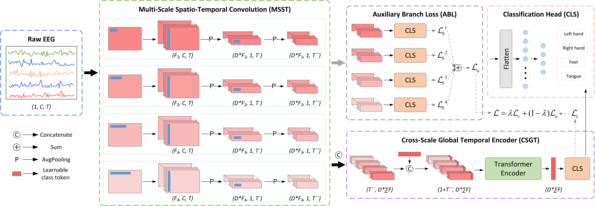
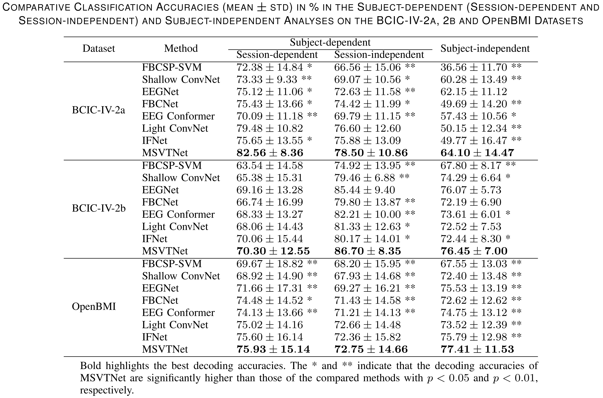

# MSVTNet: Multi-Scale Vision Transformer Neural Network for EEG-Based Motor Imagery Decoding

## Architecture

The proposed MSVTNet network comprises three main blocks: multi-scale spatio-temporal convolutional (MSST) block, cross-scale global temporal encoder (CSGT) block, and auxiliary branch loss (ABL) block. Each branch in the MSST block extracts local spatiotemporal feature representations from the MI-EEG signals. By using multiple independent branches across different scales, more informative encoded representations can be extracted. Before entering the CSGT block, the encoded features from different scales of the MSST block and a class token are concatenated along the feature dimension to create an integrated global spatiotemporal representation enriched with multi-scale features. Internally within the MSST block, cross-scale global temporal correlations are modeled through a multi-head self-attention (MHSA) mechanism, and the embedded class token is further input into the classifier (CLS) for final decoding. The ABL block, serving as intermediate supervision, addresses the parameter imbalance problem between the MSST and CSGT blocks to prevent overfitting. At the same time, it enhances the feature extraction capabilities of each branch.

## Implementation

All the core codes are placed in the [dpeeg](https://sheeptao.github.io/dpeeg/) in the form of package functions, which provides some convenient interface functions to support the experiments in this paper. This repositories only provides the top-level training code. For details about the training code and related experimental methods, please check [dpeeg](https://sheeptao.github.io/dpeeg/).

After installing [dpeeg](https://sheeptao.github.io/dpeeg/), you should be able to run the code in the repositories correctly. All training details of the algorithms are also provided in the [out](https://github.com/SheepTAO/MSVTNet/tree/main/out) folder for reference.

## Results

The classification results for MSVTNet and other competing architectures are as follows:

# Cite
